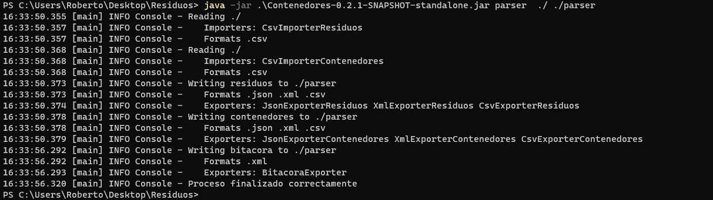
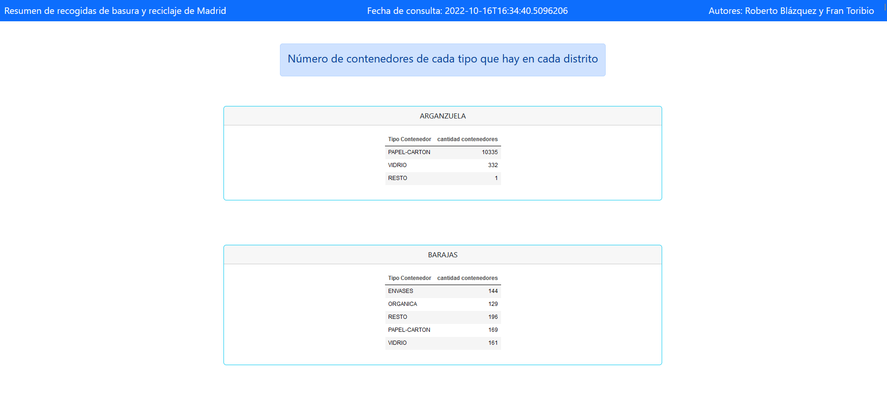
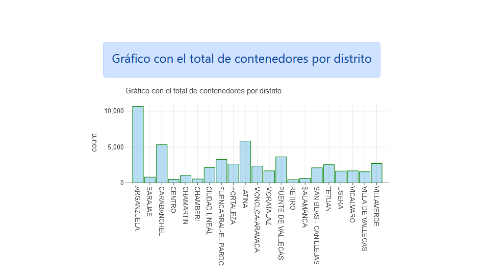
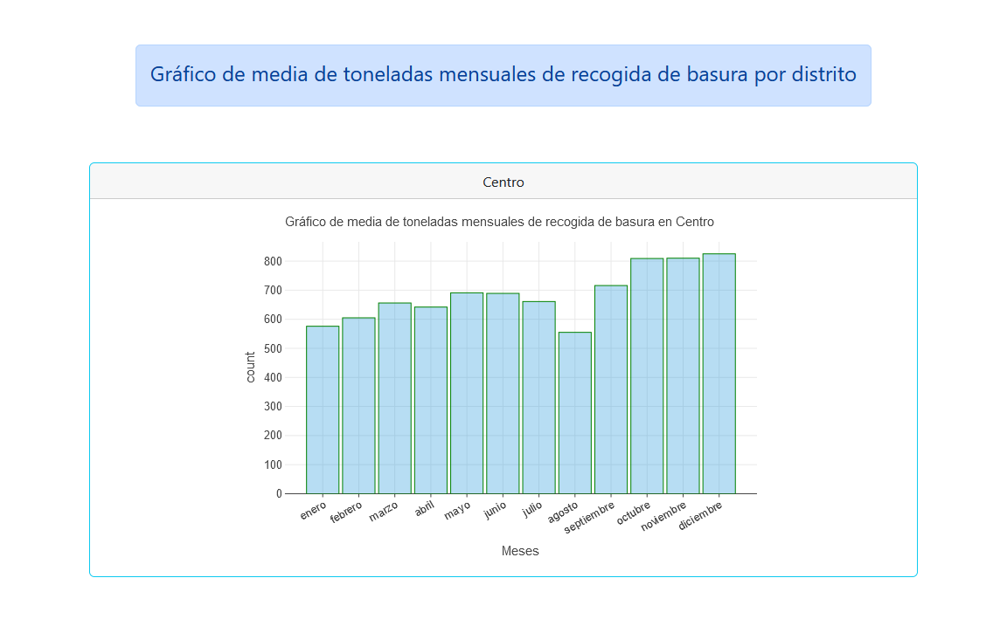

## Contenedores [](https://github.com/xBaank/Contenedores/actions/workflows/gradle.yml)


### Autores: Roberto Blázquez y Francisco Toribio

CLI para la importacion y exportacion de datos de residuos y contenedores en diferentes formatos.

## Formatos

- JSON
- XML
- CSV
- HTML

## Argumentos

| Opcion  | Argumentos                                                  | Descripcion                                |
|---------|-------------------------------------------------------------|--------------------------------------------|
| Parser  | [Directorio origen] [Directorio destino]                    | Exporta los csv a json y xml               |
| Resumen | [Directorio origen] [Directorio destino]                    | Exporta a html                             |
| Resumen | [Nombre distrito]  [Directorio origen] [Directorio destino] | Exporta a html solo los datos del distrito |

## Ejemplo

```bash 
java -jar Contenedores.jar parser ./ ./Formatos
java -jar Contenedores.jar resumen ./ ./Formatos
java -jar Contenedores.jar resumen centro ./ ./Formatos
```

## Capturas







